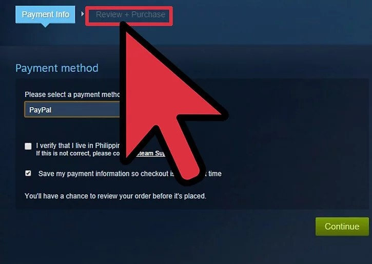

## Table of Contents

+ [Steam Client](#steam)
    + [What is Steam?](#what)
+ [Steam Installation](#install)
+ [Steam Store](#store)
    + [What is the Steam Store?](#store_what)
    + [How do I find a game I want to play?](#store_find)
    + [How do I buy a game?](#store_buy)
+ [Big Picture Mode](#bigpic) 
    + [What is Big Picture mode?](#bigpic_what)
    + [What platforms does Big Picture mode support?](#bigpic_plat)
    + [How to launch Big Picture mode](#bigpic_launch)
    + [What controllers are supported?](#bigpic_support)
+ [Family Library Sharing](#sharing)
    + [How do I setup Family Sharing?](#sharing_setup)
    + [Which devices and accounts have access to Family Library Sharing?](#sharing_access)
    + [Frequently Asked Questions](#sharing_faq)
+ [Steam Guard](#guard)
    + [What is Steam Guard and how does it help me?](#guard1)
    + [How do I enable Steam Guard?](#guard2)
    + [Is there a limit to the number of machines that can be authorized?](#guard5)
    + [How do I deauthorize a device?](#guard6)
    + [I'm not receiving a Steam Guard email…](#guard8)
    + [Why am I being asked to authenticate a "new device" every time I log in on the same device?](#guard9)
    + [Will Steam Guard prohibit me from logging into 3rd party sites that sign in through Steam?](#guard11)
    + [How do Steam Guard enabled accounts get stolen?](#guard12)
    + [Why does Steam report 'Steam Guard not enabled' while the Steam Guard button is missing?](#guard13)
+ [Steam Broadcast](#broadcast)
    + [How do I watch a Broadcast?](#broadcast_watch)
    + [How do I set up a Broadcast?](#broadcast_setup)
    + [What is recorded and included in my broadcast?](#broadcast_what)
    + [Frequently Asked Questions](#broadcast_faq)

##  Steam Client
###  What is Steam?
Steam is an online platform where you can buy, play, create, and discuss PC games. We host thousands of games (as well as downloadable content, or DLC, and user-generated features called "mods") from major developers and indie game designers alike.

Steam is also a cloud-based gaming library. One of our most popular features is the ability you and other users to use any computer to play games they buy or download to their Steam accounts. This also allows you to store a large collection of games without using too much computer memory. To use Steam, you have to download and install the Steam "engine" or app on your computer. Once you do that, you have access to our full library of games, software, and forums!

##  Steam Installation
Steam itself is free to use, and free to download. Here's how to get Steam, and start finding your own favorite games.

1. Ensure that you are logged in as an administrator on the machine which you would like to install Steam on
2. If you have previously installed Steam and are reinstalling to remedy a problem with your prior installation, you can just run the Steam installer again and it will automatically reinstall Steam
3. Check the [Troubleshooting Network Connectivity](https://help.steampowered.com/en/faqs/view/669A-2F68-D1D1-A5EC) topic to ensure the required ports for Steam are open on your network
4. Download and run the correct Steam Installer for your platform from https://store.steampowered.com/about/

If you encounter any difficulty with your installation, please see the [Contacting Steam Support](https://help.steampowered.com/en/faqs/view/6F69-0324-B2DB-6E7E) topic for instructions to contact Steam Support.

If you are looking for information on how to uninstall Steam please see the [Uninstalling Steam](https://help.steampowered.com/en/faqs/view/3C73-90F9-F600-0266) topic. 

##  Steam Store
###  What is the Steam Store?
The Steam Store, also known as the Steam Storefront, is a digital storefront for selling and distributing games and software to you or other Steam users. Software purchases are tied to you through a software license on your Steam account, allowing unlimited downloads of the purchased software on any compatible device. The store accepts payment in multiple currencies, which is dependent on your location set by the storefront. 

###  How do I find a game I want to play?
You can use the search field function within the Steam store to search for the games you want to buy. If you do not have a particular game in mind to buy, you can use advanced search functions to seek for a game by genre, price, developer, publisher, category, operating system, and Metascore.

To use the advanced search function, click on the magnifying glass icon next to the search field and then click on "advanced search." Steam also lists current top sellers as well as games that are on sale.

###  How do I buy a game?
Steam is an alternative for buying PC games digitally, instead of having to own physical copies of games. When you buy a game from Steam, it downloads directly to your computer and automatically installs itself. 

1. Add games to your shopping cart by clicking on the "Add to Cart" button. This button will also list the price of the game as well as indicate whether or not the game is currently on sale. This will also bring you to your newly created shopping cart.

If you have not previously done so, you will need to enter digital payment information.

2. Access your cart when you are ready to check out and buy the games you selected. Once you have items in your shopping cart, a green "cart" button will appear in the upper right portion of your steam application. It will also list, in parenthesis, the number of items you have in the cart. 

3.  Choose whether to buy the game for yourself or whether you want to send it as a gift to a friend or family member.
If you are sending the game as a gift, you can either have the information sent to the person's email address with information on how to access the gift, or allow them to unlock it directly through Steam.

4.  Finalize your order by viewing the "Review + Purchase" screen, checking the terms box, and clicking the "purchase" button. 

##  Big Picture Mode
###  What is Big Picture mode?
Big Picture is a mode of Steam designed for use with your TV and game controller, so you can enjoy your Steam games from the comfort of your couch. With the press of a button, Steam displays a full-screen user interface which has been completely redesigned for readability and interaction on TV. It can also be used on your usual computer display.

###  What platforms does Big Picture mode support?
Big Picture is currently available on any PC running Windows 7 or newer, any Mac running macOS 10.11 or later, and Linux machines using up to date versions of Ubuntu. The full list of requirements is provided below.

|       | Requirement |
| ----------- | ----------- |
| OS      | Windows Vista or newer, Mac OS X 10.7 (Lion) or newer, Linux Ubuntu 12.04 or newer, SteamOS.       |
| Memory   | 1 GB RAM        |
| Processor   | 3.0 Ghz P4, Dual Core 2.0 (or higher) or AMD64X2 (or higher)        |
| Video card   | Required / at least 256MB memory and DirectX 10-compatible with support for Pixel Shader 4.0, Recommended / 512MB+ memory and DirectX 10-compatible        |
| Disk space   | 1 GB recommended        |
| Internet connection   | Broadband recommended        |
| Controller   | Xbox 360 Wireless Controller for Windows, Xbox One or Xbox 360 Wired Controller, or Logitech Wireless Gamepad F710 recommended. Keyboard and mouse also supported.        |

On the Mac, a third-party driver must be used to enable the Xbox 360 controller. A driver is available from TattieBogle.net.

###  How to launch Big Picture mode
Once your computer is running on the desired display, launch Steam. Click the "Big Picture" button featured in the top right corner in the Steam client, or press the home button on your controller while using the Steam client. You can exit Big Picture's fullscreen mode by pressingALT + ENTER on your keyboard.

###  What controllers are supported?
Any Steam game can be played while in Big Picture mode, though not all Steam games support the use of a controller. Currently, Big Picture supports the following controllers:

+ The Steam Controller
+ The official Microsoft Xbox One Wired Controller
+ The official Microsoft Xbox One S Controller (wired or wirelessly using + Bluetooth)
+ The official Microsoft Xbox One Elite 2 Controller (wired or wirelessly using + Bluetooth)
+ The official Microsoft Xbox 360 Wired Controller
+ The official Microsoft Xbox 360 Wireless Controller for Windows (with + wireless receiver)
+ Sony Dualshock 4 (wired or wirelessly using Bluetooth)
+ The official Nintendo Switch Pro Controller (wired)
+ Logitech Wireless Gamepad F310, F510, and F710
+ SteelSeries Stratus Duo

To determine whether a game is controller-enabled, please refer to the following tags:

Full Support

Titles marked with "Full Controller Support" indicate that they can be downloaded, launched and played using only a controller. These titles do not require a mouse or keyboard on hand for any configuration or in-game setup.

Partial Support

Titles marked with "Partial Controller Support" indicate that mouse and keyboard may be required from time to time. A controller may be used while in game, however installation, configuration and overall user interface may only be optimized for mouse and keyboard.

##  Family Library Sharing
Family Sharing allows family members to share games while keeping their accounts separate.

Family and guests can play one another's games while earning their own Steam achievements and saving their own game progress to the Steam Cloud. It works by granting family members access to games on a shared computer.
###  How do I setup Family Sharing?
There are two recommended methods for authorizing shared libraries. Both require that Steam Guard be enabled on all accounts.

#### Authorizing another user:
1. Log into your Steam account on the computer where you'd like to share your games.
2. Make sure that you have Steam Guard security enabled via Steam > Settings > Account in the Steam Client.
3. From the Steam Settings panel select the Family tab (or in Big Picture mode, Settings > Family Library Sharing). Here you can select users who have also logged into this computer to share your library with.
4. Click the "Authorize Library Sharing on this Computer" box.

5. Check the box next the account you'd like to share your Library with.

#### Requesting access from owner:

1. Enable Steam Guard on your Steam Account.
2. From your Library you'll be able to see games owned by other Steam accounts that use the same computer. Select a game and click "Play" to request access to that respective Library. This will send the game owner an email with a link to allow you to play games in their Library.

3. Wait for the game owner to authorize your computer and grant your Steam account access to their games.

###  Which devices and accounts have access to Family Library Sharing?
You can log into the Steam client and visit the "Family" tab in Settings, where you'll find a link "Manage other computers". Here you can deauthorize any computer or account that's been authorized to share your library.

Or, you can remotely deauthorize computers from the web. Visit your Account Details page, and then select "Manage Family Library Sharing". Using either the client or the web site, you can view all currently authorized devices and accounts and use the revoke link to deauthorize any or all of them.

###  Family Library Sharing Frequently Asked Questions
###  Can I share my games with users that don't live with me?
While Family Sharing can work for users that are not accessing Steam from the same location, due to technical limitations, the feature may encounter issues that Steam is unable to provide support for.
###  I want to play my own games, but they're being played by another account. What do I do?
As the owner, you may always access and play your games at any time. If you decide to start playing when another user is already playing one of your games, he/she will see a message giving them five minutes to either purchase or quit out of the game.
###  Can I share specific games?
No, libraries are shared in their entirety. You aren't able to select specific games to share or exclude.

Additionally, for users that are borrowing multiple Steam Libraries, they will be unable to choose who they borrow a game from.
###  Can all Steam games be shared?
No, due to technical limitations, some Steam games and content may be unavailable for sharing. Games or content that matches the criteria below cannot be shared between accounts.
+ Games that require an additional third-party key, account, or a + subscription in order to play
+ Free to play games and any purchased DLC for those games
+ Free DLC for a game
+ Games or DLC that is restricted in your or the borrower's region
+ Games the owner has a VAC or Game Ban in
+ Base games that the borrower already owns
+ Games that do not support the borrower's operating system
+ Games the owner has (automatically) from belonging to a Steamworks partner account
###  Can two users share a library and both play at the same time?
No, a shared library may only be played by one user at a time including the owner and even if they want to play different games.

###  Is there a limit to the number of accounts I can share my Library with?
Yes. A Steam account may authorize Family Library Sharing on up to 5 accounts and on up to 10 devices in a 90 day period. This includes accounts/devices that you have cancelled sharing with in that same time period.
###  Can DLC and in-game content be shared?
A borrower will have access to the lender's games and DLC, but only if the borrower does not
also own the base game. If they already own the game, they'll need to purchase the DLC themselves in order to play it. For free to play games, DLC cannot be shared since all Steam users "own" the game.

Any user may purchase, trade, earn, or otherwise acquire in-game content while playing a game, but in-game items cannot be shared between accounts. These items remain the property of the account that purchased or acquired them.
###  Can region-restricted games be shared across regions?
No, any region restrictions will remain in place when lending or borrowing games.

###  What if a borrower is caught cheating or committing fraud while playing my shared games?
Your Family Sharing privileges may be revoked and your account may also be VAC banned if a borrower cheats or commits fraud. In addition, not all VAC protected games are shareable. We recommend you only authorize familiar Steam Accounts and familiar computers you know to be secure. And as always, never give your password to anyone.

##  Steam Guard
###  What is Steam Guard and how does it help me?
Steam Guard is an additional level of security that can be applied to your Steam account. The first level of security on your account is your login credentials: your Steam account name and password. With Steam Guard, a second level of security is applied to your account, making it harder for your Steam account to fall into the wrong hands.

When Steam Guard is enabled on your account, you'll need to provide a special code to login from an unrecognized device. Depending on your Steam Guard settings, you'll either receive an email with the special code or you'll get it from the Steam Mobile app on your smartphone.
###  How do I enable Steam Guard?
#### Enabling Steam Guard by email
Steam Guard is enabled by default on your Steam account if your email is verified and you have restarted Steam twice on your computer since verifying your email. If you have disabled Steam Guard, and wish to reactivate it, please follow the instructions below:

1. Verify your contact email address with Steam. You can check whether your email address is already verified by visiting Account Details page. A verified address will be marked as "Verified." 

2. Enable Steam Guard in Steam Settings.
While logged into the Steam client, you can enable Steam Guard by clicking on "Steam" in the top left hand corner of the client. Then Select "Settings", and click "Manage Steam Guard Account Security" under the "Account" tab. On the page that appears, select "Get Steam Guard codes by email (will require you to re-login)".

#### Enabling Steam Guard by smartphone
Getting Steam Guard codes via your smartphone provides the best level of Steam account security because you're authorizing your logins with a physical device that you possess. You'll need to download and install the free Steam Mobile app to your phone.

That's it! With Steam Guard enabled, you will be asked to enter the special access code sent to your email address each time you login to Steam from an unrecognized device.
###  Is there a limit to the number of machines that can be authorized?
No, there's no limit. Steam Guard is aimed to protect the value that is yours, not limit your access to your stuff. As always, you can access your Steam account and library from as many machines as you'd like.
###  How do I deauthorize a device?
Deauthorizing a machine removes it from Steam Guard authorization, which means that it will look like a new device the next time you use it to log in, and a Steam Guard code will be required.

If you've mistakenly checked the "remember me" box when logging in to a public computer or if your account has been compromised, you should deauthorize any computers that you've previously added to Steam Guard. You can do this from your Account Details page > Manage Steam Guard and select "Deauthorize all other devices" at the bottom of the page. This will deauthorize all computers or devices other than the one you're performing this action from.

###  I'm not receiving a Steam Guard email…
Make sure that you are watching the correct inbox for the email address associated with your Steam account.

If you are not receiving the e-mail at all, check your spam filters and spam inbox.

Please try adding "support@steampowered.com" and "noreply@steampowered.com" to your contacts or trusted senders list within your email client and request a new access code.

Even though Steam instantly sends an email, you may encounter a delay with some email providers depending on their server load and processing times. Please contact us if you have not received the verification email after 3 hours.
###  Why am I being asked to authenticate a "new device" every time I log in on the same device?
This may be caused by your browser's security settings. If your web browser's ‘Privacy’ settings are set too high, then your browser will be unable to store (web) cookie information. Check your browser settings to ensure that cookies are allowed.

Running programs that clear internet history, delete other types of unused files, block cookie creation, or clean up orphaned registry entries may also be responsible for this issue. Disabling such programs will prevent this issue from occurring when logging into Steam via your web browser.

###  Will Steam Guard prohibit me from logging into 3rd party sites that sign in through Steam?
No, Steam Guard will not limit your ability to access your Steam account through third-party websites that enable a sign-in via your Steam account credentials.
###  How do Steam Guard enabled accounts get stolen?
Steam Guard protects your Steam account by requiring access to your verified email account. This second layer of security depends on your email account also being secure. Below are the common methods used to steal accounts with Steam Guard enabled:

+ Through Email: If your verified email account is stolen or compromised, a user can enter your account freely provided they know your account name. Knowing your Steam account password would not be required as this can be reset with access to your email account. Never use the same password for both your email and Steam account.
+ Malware: Hijackers can use malware to gain access to your computer and login to your account using your already authorized device. Since your Steam account could be logged in or you have your account credentials saved, the hijacker does not need to know anything about your account to gain access. Using a proper anti-virus software with real-time protection and avoiding unsafe websites and files will prevent malware from entering your system.
+ Phishing: Hijackers will sometimes use social engineering to steal your Steam account information, often impersonating Steam or Valve employees. You should never provide your Steam account or personal information to someone claiming to be from Valve or Steam. Steam Support is exclusively handled through [help.steampowered.com](help.steampowered.com).
###  Why does Steam report 'Steam Guard not enabled' while the Steam Guard button is missing?
This can happen after Steam Support has restored your account. If the button to enable or change Steam Guard's settings is missing, you must restart Steam.

The Steam client's settings dialog will appear like this:

##  Steam Broadcast
Steam Broadcasting allows you to watch your friends play their favorite games. You can also set up Broadcasting to allow others to watch you play.

###  How do I watch a Broadcast?
There are a number of ways to watch broadcasts throughout the Steam Community:

+ Find public broadcasts on the community [Broadcast](https://steamcommunity.com/?subsection=broadcasts&snr=) home page. Broadcasts are also available within each product's Community Hub.
+ Watch your friends play by selecting Watch Game from the drop down next to friend's name in your friends list.

###  How do I set up a Broadcast?
As soon as you start playing a game, your friends will be able to send you a request to watch. Alternatively, you can also invite friends to watch your game by selecting Invite to Watch from the drop down next to their name in the Friends List.

The first time a friend requests to watch your game, you'll be presented with Broadcasting settings. Choose from the settings below to setup your broadcasting space:

+ Broadcast is disabled
+ Friends can request to watch my games (default)
+ Friends can watch my games
+ Anyone can watch my games (public broadcast, can be found in the associated game hub)

You can access these settings at any time from the broadcast tab of your Steam > Settings inside the client

Exiting the game will end your broadcast. Alternatively, at any time you can press Stop from the Broadcast panel in the Steam Overlay (shift+tab).

###  What is recorded and included in my broadcast?
### Video
By default, Steam will only broadcast video recorded from the game you are playing. If you switch to another program or your computer’s desktop and Steam is unable to record video from the game you are playing while it is not active/in focus, viewers will see a placeholder graphic until Steam can again record video from your game.

You can optionally enable recording video of applications outside of your game through the Steam Client settings menu. Please remember that your broadcast viewers will be able to see any open windows when enabled.

### Audio
By default, Steam will only record audio from the game you are currently playing. You can enable recording a microphone or all audio played through your computer's default output device through the Steam Client Settings.

###  Steam Broadcast Frequently Asked Questions
+ [What are the browser requirements for watching?](#broadcast_watch)
+ [What are the account requirements for broadcasting?](#broadcast_acc)
+ [What kind of content is allowed?](#broadcast_allow)
+ [How do I report a broadcast?](#broadcast_report)
+ [How can I get my broadcast to show up in a game hub?](#broadcast_hub)
+ [How can I see who is watching my game?](#broadcast_see)
+ [Can I save my broadcast?](#broadcast_save)
+ [How do I change the bit rate, video dimensions, microphone, and desktop settings?](#broadcast_change)
+ [What operating systems can I broadcast from?](#broadcast_os)

###  What are the browser requirements for watching?
Steam Broadcasting is currently supported by the following browsers:
+ Steam Client
+ Google Chrome (version 39+)
+ Apple Safari (version 8+ on macOS)
+ Internet Explorer (version 11 on Windows 8; not supported on other + versions of Windows)
+ Mozilla Firefox (version 42+)

###  What are the account requirements for broadcasting?
Accounts that meet the following requirements are able to broadcast games:
+ Have made a purchase on Steam and are therefore non-limited accounts
+ Are not currently Community Banned

###  What kind of content is allowed?
As a Steam subscriber, you agree to abide by the Steam Subscriber Agreement, the Steam Online Conduct rules, and the Steam Community Rules and Guidelines. You are responsible for the use of your Account and for all of the communication and activity on Steam that results from use of your Account. Your online conduct and interaction with other subscribers should be guided by common sense and basic etiquette.

###  How do I report a broadcast?
From the broadcast window/page, select the "Report" button under the broadcast. When a broadcast is reported, Steam may save some or all of the broadcast for review.

###  How can I get my broadcast to show up in a game hub?
If you select "Anyone can watch my game" as your broadcast privacy setting then your broadcast will be visible in that Game Hub.

###  How can I see who is watching my game?
You'll receive a notification when a friend either requests to watch or starts watching your game. At any time you can see a list of viewers from the Steam overlay broadcast box, or if you're watching your own broadcast, from the top of the chat.

###  Can I save my broadcast?
No, broadcasts are currently live only. However, if a video is reported for review, Steam may save some or all of the broadcast for review.

###  How do I change the bit rate, video dimensions, microphone, and desktop settings?
For advanced Broadcast settings:
1. Go to the upper left in the Steam client and select Steam and then Settings
2. Select the Broadcasting tab on the left as seen below

###  What operating systems can I broadcast from?
Steam Broadcasting is currently supported through the Steam Client on Windows 7, 8, and 10. Linux and macOS will be supported in the future.
