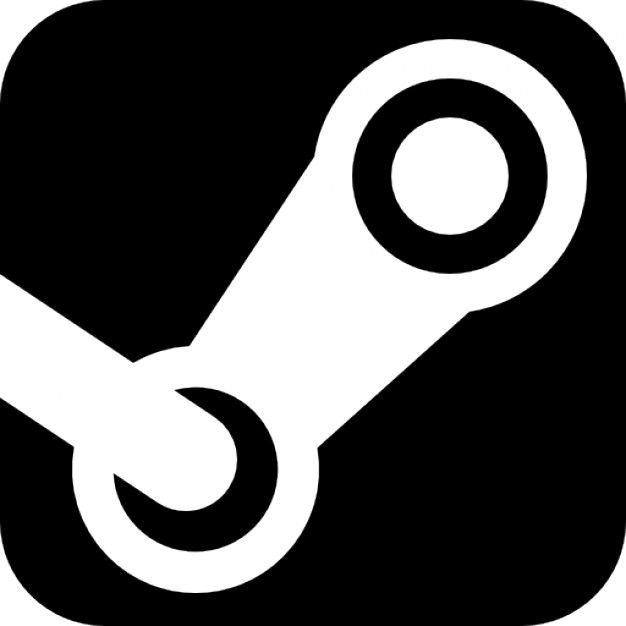
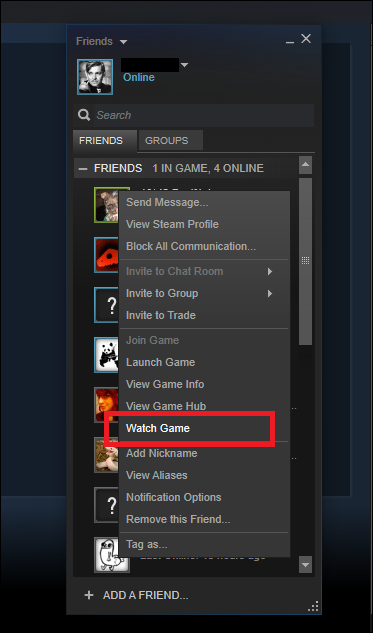

# Steam 

## Table of Contents

+ [Steam Client](#steam)
    + [What is Steam?](#steam_what)
    + [How do I install Steam?](#steam_install)
+ [Steam Account](#acc)
    + [Why do I need a Steam account?](#acc_why)
    + [How do I make a Steam account?](#acc_how)
+ [Steam Store](#store)
    + [What is the Steam Store?](#store_what)
    + [How do I search for a game?](#store_find)
        + [I'm not sure what game I am looking for?](#store_adv)
    + [What is my discovery queue?](#store_queue)
    + [Where can I find the hardware requirements for a game?](#store_req)
    + [Where can I find reviews for a game?](#store_review)
    + [How do I buy a game?](#store_buy)
+ [Steam Library](#lib)
    + [What is my Steam library?](#lib_what)
    + [What are collections?](#lib_collect)
        + [How do I create a new collection?](#lib_collect_create)
        + [How do I add a game to an existing collection?](#lib_collect_add)
        + [How do I create a new dynamic collection?](#lib_dynamic)
    + [How do I download a game?](#lib_dl)
    + [How do I launch a game?](#lib_launch)
    + [Can I add a non-Steam game to my library?](#lib_nonsteam)
    + [What is the Steam Cloud?](#lib_cloud)
        + [How do I turn on/off the Steam Cloud?](#lib_cloud_enable)
    + [What is Family Sharing?](#lib_sharing)
+ [Steam Community](#comm)
    + [What is the Steam Community?](#comm_what)
        + [How do I find the Steam Community for a specific game?](#comm_game)
    + [What are Steam Discussions?](#comm_disc)
    + [What is the Steam Workshop?](#comm_work)
    + [What is the Community Market?](#comm_market)
    + [What are Steam Broadcasts?](#comm_broadcast)
        + [How do I watch a broadcast?](#comm_broadcast_watch)
        + [How do I start a broadcast?](#comm_broadcast_start)

##  Steam Client
###  What is Steam?
Steam is an online digital distribution platform that allows users like you to buy and play video games by yourself and with friends and create community content. We host thousands of games and software from major and indie developers, all available to you! You can join millions of other users and start gaming today.

Steam is free to download and use and is available on  Windows, macOS, and Linux systems. 
###  How do I install Steam? 
You need to install the Steam client in order to take full advantage of the Steam platform. Fortunately for you, Steam is extremely simple to install and setup!

**Note:** You will need at least 500 MB of free space on your hard disk to install Steam.

Follow the steps below to get Steam up and running:

1. Go to [steampowered.com](http://steampowered.com). This will direct you to Steam's main store page. 
.png)

2. Click on the green "Install Steam" icon. This will direct you to the download link for Steam's installer.
.png)

3. Click on the blue "INSTALL STEAM" icon. This will begin the download for the Steam installer. It will be named "SteamSetup.exe"
.png)

4. Run the Steam installer and follow the prompts. 
.png)

Once the Steam installer finishes, Steam is ready to use on your system!

##  Steam Account
###  Why do I need a Steam account?
A Steam account is required to use any of the Steam services. It allows users like you to link games and content to a personal library and be able to connect with your friends. 
###  How do I make a Steam account?
Just like installing the Steam client, making a Steam account is very simple. 

**Note:** You need to be over the age of 13 to make a Steam account.

Follow the steps below to create your own Steam account:

1. Go to the Steam page to create a Steam account ([https://store.steampowered.com/join/](https://store.steampowered.com/join/))

    .png)

2. Fill out the on-screen prompts for your email address and country of residence and click continue.

3. Confirm your email. Steam will ask you to confirm the email you entered. Check your email inbox and verify your email according to the instructions in the email.

    .png)

4. Create your username and password. Your username is unique to you but will not be visible to other users. 

    .png)

Once you click "Done", you have created your Steam account! Any games you purchase from the Steam store will be linked to your Steam account. 

##  Steam Store
###  What is the Steam Store?
The Steam Store is our digital distribution platform. Here you can browse and buy any of thousands of video games. However, the Steam Store is not limited to just buying games. Each game page contains information on each game, such as descriptions, content tags, user reviews and scores, Steam achievements, and much more! 

###  How do I search for a game?
You can search for any game in the Steam Store using the search bar. 

.png)

Type in the title of the game or games you are looking for and the search bar will suggest the closest titles. Click on any of the suggested titles to go to their respective store page.

.png)

###  I'm not sure what game I am looking for?
If you don't know the title of the game you are looking for or aren't looking for a specific game, you can try our advanced search function. You can access this by clicking the magnifying glass in the search bar.

.png)

With the advanced search, you can filter thousands of games with tags. 

.png)

There are many different types of tags you can filter with. Here are a few tag types and their descriptions:

- **Price** Sets an upper bound on the price of a game
- **Tag** Filters based on game content
- **Type** Filters based on content type (e.g. games, software, downloadable content)
- **Number of players** Filters based on how many players can play
- **Feature** Filters based on compatibility features
- **VR Support** Filters based on if a game supports VR

###  What is my discovery queue?
Your Steam discovery queue is a mix of games and products that are new and similar to what you already play and use on Steam. You can use your discovery queue to discover new games to play. 

.png)

Once you look through your current discovery queue, a new one will be generated.

The queue won't show any games that you already have in your Steam library, your wishlist, or anything you've already seen in a previous discovery queue.

###  Where can I find the hardware requirements for a game?
You can find the system requirements for a game on their Steam Store page. Below is an example of the system requirements for a game.

.png)

The system requirements will typically give two sets of requirements. The minimum system requirements gives specifications that will allow the system to run the game. The recommended system requirements will allow for optimal performance in the game.

###  Where can I find reviews for a game?
Steam allows users to review games they own. You can find the user reviews for a game on their Steam Store page. Below is an example of the user reviews of a game:

.png)

You can filter user reviews by a number of different tags, such as positive or negative reviews. 

###  How do I buy a game?
Follow the steps below to buy a game on the Steam Store:

1. Click on the "Add to Cart" icon on the game's store page. This will add the game to your shopping cart and bring you to your shopping cart. 
.png)

2. Click on the "Purchase for myself" icon. This will bring you to the checkout page. 
.png)

3. Fill out your payment information and click "Purchase".

Once the transaction finishes, your purchased game will appear in your Steam Library. 

##  Steam Library
###  What is my Steam library?
The Steam Library is the collection of games and software that is linked to your Steam account and that you own. You can download any of your games from the Steam Library.

###  What are collections?
Collections are a way for you to organize your Steam library. There are two types of collections that you can create and add games to. Below are the types and what they do.

- Collection: Manually add games to a collection
- Dynamic Collection: Use filters to create collections that update as your library grows

###  How do I create a new collection?
1. Click the collections icon in your Steam library.

    _LI.jpg)

2. Click on "Create a new collection" to create a new collection. This will prompt you for a collection name and type.

    .png)

3. Enter a collection name and select "Create Collection"

    .png)

After you choose to create a collection, your new collection will be created and games can be added to it. 

###  How do I add a game to an existing collection?
You can drag games from your Steam Library list to add it to the desired collection.

_LI.jpg)

###  How do I create a new dynamic collection?
Creating a dynamic collection is similar to creating a collection. Follow the steps below:

1. Click the collections icon in your Steam library.

    _LI.jpg)

2. Click on "Create a new collection" to create a new dynamic collection. This will prompt you for a collection name and type.

    .png)

3. Enter a collection name and select "Create Dynamic Collection"
    
    .png)

4. Enter the tags by which you would like the dynamic collection to filter by.
    
    .png)

Once you've selected the filter tags for the dynamic collection, the new dynamic collection will automatically add any games in your library that match the tags. 

###  How do I download a game?
In your library list, you can click on the title of the game you would like to install. This will bring up the library page of the game. You can then click on the blue "Install" icon to install the game.

.png)

###  How do I launch a game?
**Note:** You will need to have installed the game in order to launch it.

In your library list, you can click on the title of the game you would like to play. This will bring up the library page of the game. You can then click on the green "Play" icon to launch the game. 

.png)

###  Can I add a non-Steam game to my library?
Yes, you can add games that you did not buy on the Steam store to your Steam library. Follow the below steps to do so:

1. Click on "Games" in the context bar of the Steam client.
    
    .png)

2. Click on "Add a Non-Steam Game to My Library...". This will bring up a window of installed programs.

    .png)

3. Choose the game from the list of installed programs to add to your Steam Library.

Once you click "Add selected programs", the non-Steam games will show up in your Steam library. 

###  What is the Steam Cloud?
The Steam Cloud allows for games to save game settings, save games, profile stats and other user-specific data to cloud storage hosted by Steam. Any data saved to the Steam Cloud is persistent on an account regardless of the machine it is logged on to, as the data is pulled from the Steam Cloud and applied locally. 

###  How do I turn on/off the Steam Cloud?
If you want to locally manage the data from a game, you can toggle enable or disable the Steam Cloud. Follow the steps below:

1. Right click on the game in the Steam library list. This will bring up a context menu.
    
    .png)

2. Select "Properties..." This will bring up a new window for the properties of the selected game. 

    .png)

3. Toggle the "Keep games saves in the Steam Cloud for ...". This will turn on or turn off the Steam Cloud for the game.

###  What is Family Library Sharing?
Family Library Sharing allows Steam users on the same machine to share their Steam Library with one another. Users on the machine can play shared games and retain achievements and game progress on their own accounts. 

##  Steam Community
###  What is the Steam Community?
The Steam Community is a feature within the Steam client that enables users to discuss games and interact with other users.

The Steam Community is comprised of the following subsections:

- **Screenshots** Screenshots of a game
- **Artwork** User-created artwork of a game
- **Broadcasts** Live streams of a game
- **Videos** User-created videos of a game
- **Workshop** User-created content of a game, such as mods
- **News** Developer news of a game
- **Guides** Walkthroughs for a game
- **Reviews** User reviews for a game

###  How do I find the Steam Community for a specific game?
In the Community tab of the Steam client, you can search for Steam community of a specific game using the community search bar. 

_LI.jpg)

Below is an example discussion page for the game Destiny 2

.png)

###  What are Steam Discussions?
Steam Discussions are a message board for discussing anything and everything related to a game. You can do anything from asking for help to posting a guide. However, this does not give you the right to post offensive content! Please review the [Rules and Guidelines](https://help.steampowered.com/en/faqs/view/6862-8119-C23E-EA7B) before you start posting. 

Below is an example Steam Discussion for the game Destiny 2:

.png)

###  What is the Steam Workshop?
The Steam Workshop provides a place and the tools for users to create, upload and download player-created content, such as mods, for games.

Below is an example workshop page for the game Skyrim:

.png)

###  What is the Community Market?
The Community Market allows users to buy and sell items with community members for Steam Wallet funds. 

.png)

###  What are Steam Broadcasts?
Steam Broadcasts allow users to watch other users playing a game. You can also set up a broadcast so others can watch you play.

###  How do I watch a broadcast?
There are a number of ways to watch broadcasts throughout the Steam Community:

- Find public broadcasts on the Steam Community Broadcast  page. Broadcasts are also available within each game's Community Hub.
    .png)

- Watch your friends play by selecting "Watch Game" on your friend's name in your friends list.
    

###  How do I start a broadcast?
You can start a Broadcast anytime you are playing a game and a friend requests to watch your game. 

The first time a friend requests to watch your game, you'll be able to choose the privacy settings of your broadcast:
- Broadcast is disabled
- Friends can request to watch my games (default)
- Friends can watch my games
- Anyone can watch my games  

You can access or change additional settings within the Steam settings under Broadcasting

.png)

Ending the game will end your broadcast.